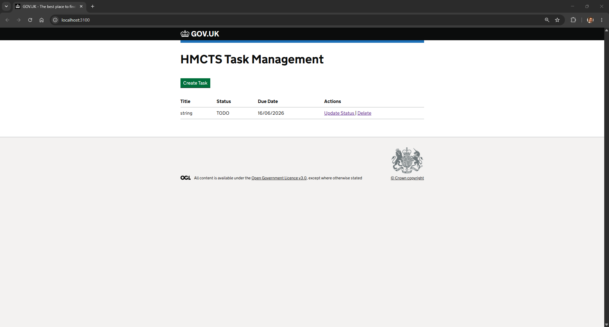
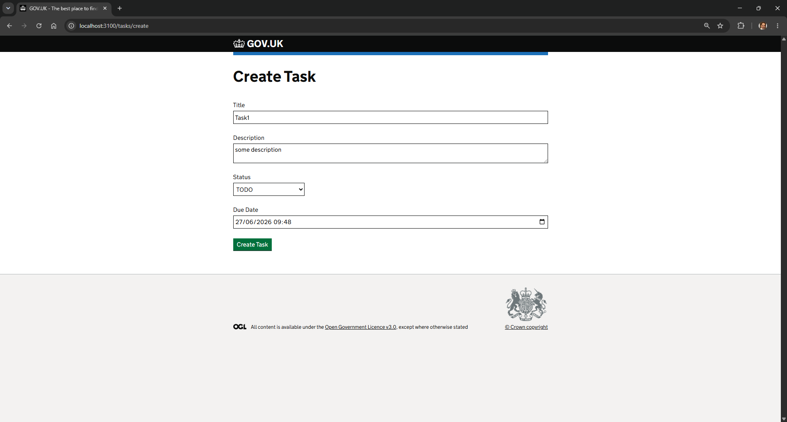
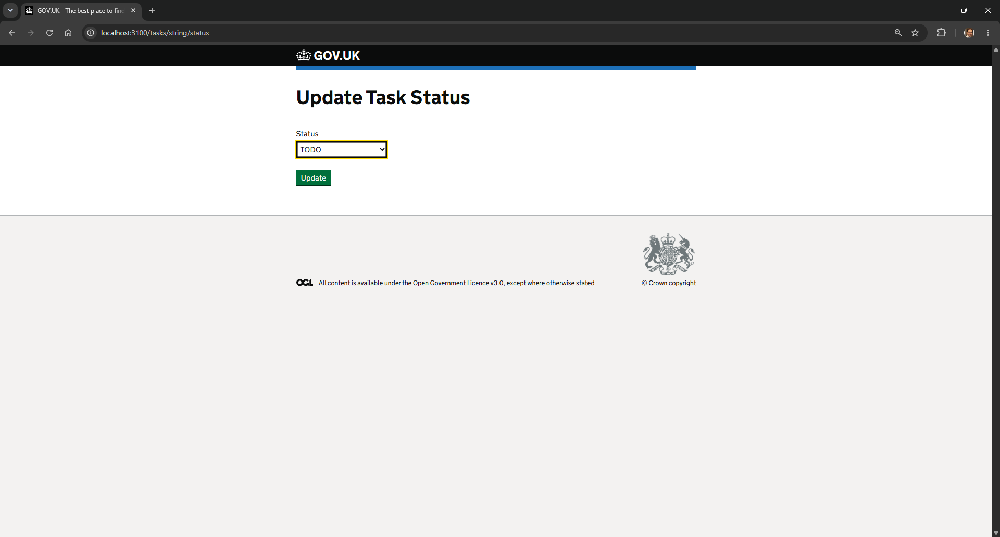
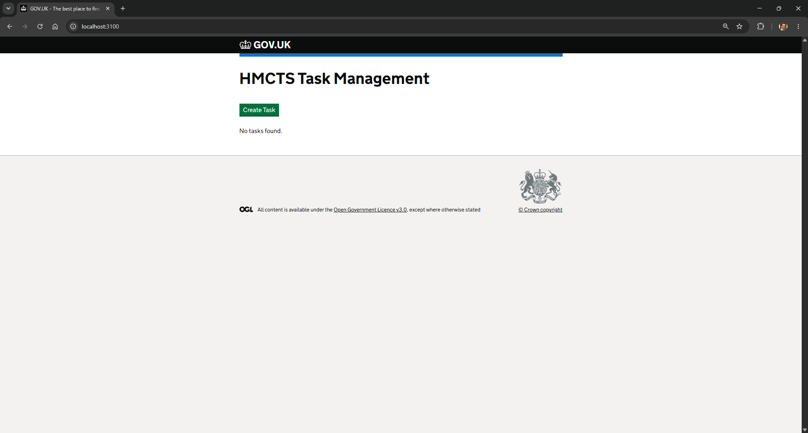

# HMCTS Task Management Frontend

Frontend application for the HMCTS Developer Challenge.

Built using:
- Node.js
- TypeScript
- Express
- Nunjucks
- GOV.UK Frontend

## Features

The application allows users to:

- View all tasks
- Create a new task
- Update a task status
- Delete a task

The frontend consumes the backend REST API and presents the data using GOV.UK Design System components.

## Prerequisites

- Node.js 20+
- Yarn
- HMCTS Task Management Backend running locally

## Installation

Install dependencies:

```bash
yarn install
```

## Running the Application

Start the development server:

```bash
yarn start:dev
```

The application will be available at:

```text
http://localhost:3100
```

## Backend Dependency

The frontend expects the backend API to be running on:

```text
http://localhost:4000
```

If the backend runs on a different port, update the API URL in the route files.

## Available Functionality

### View Tasks

Displays all tasks returned by the backend API.

### Create Task

Allows users to create a task with:

- Title
- Description
- Status
- Due Date

### Update Status

Allows users to change the status of an existing task.

### Delete Task

Allows users to remove an existing task.

## Project Structure

```text
src/main/routes
├── home.ts
├── create.ts
├── update.ts
└── delete.ts

src/main/views
├── home.njk
├── create.njk
└── status.njk
```

## Screenshots

### Task List



### Create Task



### Update Task Status



### Delete Task



## Notes

This application was developed as part of the HMCTS Developer Challenge and demonstrates integration with a REST API together with a GOV.UK styled user interface.
